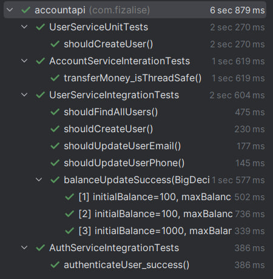
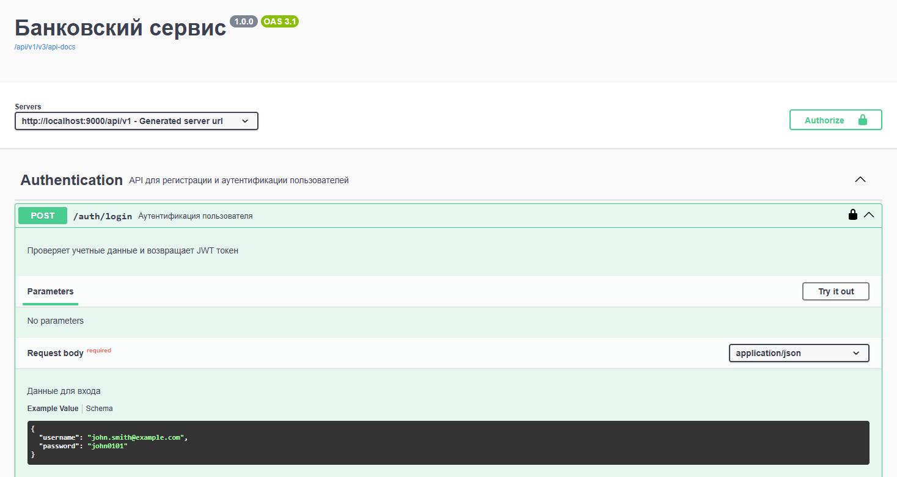

# Банковский сервис
## Использованные технологии

### База данных

База данных - `PostgreSQL 16`

Система миграции - `Flyway Migrations`

### Схема базы данных
#### Таблица: USER

| Key type | Column        | Type         | Unique | Comment                                                                   |
|----------|---------------|--------------|--------|---------------------------------------------------------------------------|
| PK       | ID            | BIGINT       | True   |                                                                           |
|          | NAME          | VARCHAR(500) | False  |                                                                           |
|          | DATE_OF_BIRTH | DATE         | False  | Формат: 01.05.1993 (форматирован в yyyy-MM-dd для корректной работы базы) |
|          | PASSWORD      | VARCHAR(500) | False  | Минимальная длина: 8, максимальная: 500                                   |

#### Таблица: ACCOUNT

| Key type | Column  | Type    | Unique | Comment                               |
|----------|---------|---------|--------|---------------------------------------|
| PK       | ID      | BIGINT  | True   |                                       |
| FK       | USER_ID | BIGINT  | True   | Ссылка на USER.ID                     |
|          | BALANCE | DECIMAL | False  | Рубли + копейки (в коде – BigDecimal) |

#### Таблица: EMAIL_DATA

| Key type | Column  | Type          | Unique | Comment              |
|----------|---------|---------------|--------|----------------------|
| PK       | ID      | BIGINT        | True   |                      |
| FK       | USER_ID | BIGINT        | False  | Ссылка на USER.ID    |
|          | EMAIL   | VARCHAR(200)  | True   |                      |

#### Таблица: PHONE_DATA

| Key type | Column  | Type          | Unique | Comment              |
|----------|---------|---------------|--------|----------------------|
| PK       | ID      | BIGINT        | True   |                      |
| FK       | USER_ID | BIGINT        | False  | Ссылка на USER.ID    |
|          | PHONE   | VARCHAR(13)   | True   | Формат: 79207865432  |

### Backend

API для приложения было написано при помощи `Spring Boot 3.4.5`

**Базовая конфигурация `Spring Boot` для всех окружений:**
```yml
spring:
  application:
    name: accountapi
  jpa:
    properties:
      hibernate:
        dialect: org.hibernate.dialect.PostgreSQLDialect
  flyway:
    locations: classpath:db/migration/base

account:
  increase:
    interval: 30s
    coefficient: 1.1
  max-balance-coefficient: 2.07
server:
  servlet:
    context-path: /api/v1
  error:
    include-message: always
```

**Также использовались:**
- `Spring Data JPA` - ORM маппинг при помощи `Hibernate`
- `Spring Security` - аутентификация при помощи `Json Web Token`

Для повышения производительности приложения
было использовано кэширование на слое `API` и на слое `бизнес-логики`
при помощи `Spring Data Redis ` & `Redis 7.0`

**Конфигурация для кэширования:**
```yml
cache:
    type: redis
    redis:
      time-to-live: 600000 # 10 минут для существования кэша
```

## Тестирование

Для проверки корректности работы приложения были написаны тесты, 
покрывающие самые важные части

Для тестирования `API-слоя`, слоя `бизнес-логики`, 
а также работы `DAO` слоя были использованы:

- Фреймворк `JUnit5` - тестирование работы бизнес и DAO слоев
- `MockMVC` - тестирование работы API-слоя

**Демонстрация выполнения всех тестов:**



## Установка проекта

1. Установите Docker Desktop на свой ПК (для daemon-а) https://docs.docker.com/desktop/setup/install/windows-install/
2. Установите и запустите `git bash`
3. Клонируйте репозиторий в желаемую папку

```shell
git clone https://github.com/duahifnv/account-api.git
cd account-api
```

## Настройка и запуск

1. Создайте и настройте `.env` файл (должен находится в корневой папке)

**Шаблон конфигурации `.env`**

```dotenv
POSTGRES_DB='название БД'
POSTGRES_USER='имя пользователя БД'
POSTGRES_PASSWORD='пароль от БД'
POSTGRES_PORT='порт для подключения к БД'

API_PORT='порт для подключения к API'

JWT_SECRET='секретный ключ в формате base64 для формирования JWT-токена'
JWT_DURATION='время жизни токена'

REDIS_PORT='порт для подключения к БД кэширования'
```

2. Проверьте, что `docker daemon` запущен

```shell
docker --version
```

### Окружение разработки

3. Запустите контейнеры окружения разработки

```shell
docker compose -f docker-compose.dev.yml up -d 
```

4. Вручную укажите заданные в `.env` параметры 
в конфигурацию `src/main/resources/application-dev.yml`

```yml
spring:
  datasource:
    url: jdbc:postgresql://localhost:[POSTGRES_PORT]/[POSTGRES_DB]
    username: [POSTGRES_USER]
    password: [POSTGRES_PASSWORD]
    driver-class-name: org.postgresql.Driver
  data:
    redis:
      host: localhost
      port: [REDIS_PORT]
jwt:
  secret: [JWT_SECRET]
  duration: [JWT_DURATION]
server:
  port: [API_PORT]
```

5.1. Запустите приложение при помощи плагина сборщика `Maven` (профиль `dev`)

```shell
./mvnw spring-boot:run -D spring-boot.run.profiles=dev
```

5.2. Выполнение всех тестов

```shell
./mvnw test -D spring-boot.run.profiles=test
```

> [!NOTE]
> В окружении разработки включено логирование на уровне `DEBUG`, которое отображает конфиденциальные данные

### Окружение `production`

3. Запустите контейнеры окружения продакшена

```shell
docker compose -f docker-compose.yml up -d 
```

### Использование API

> [!NOTE]
> Доступ к API осуществляется по адресу: 
> <br>`http://192.168.0.1:[API_PORT]/api/v1` - `production`
> <br>`http://192.168.0.1:[API_PORT]/api/v1` - `development`

> [!NOTE]
> Для исследования API воспользуйтесь `SwaggerUI` по адресу:
> <br>`http://192.168.0.1:[API_PORT]/api/v1/swagger-ui` - `production`
> <br>`http://192.168.0.1:[API_PORT]/api/v1/swagger-ui` - `development`
>
> 
